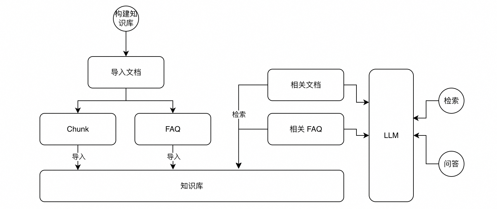
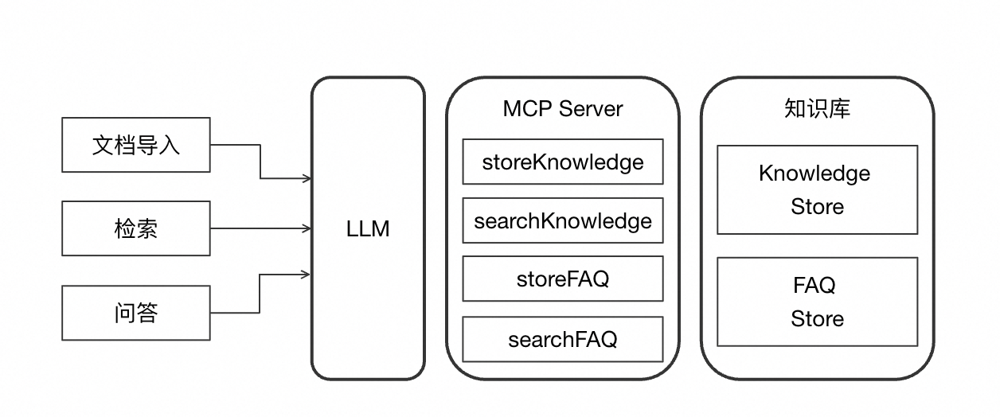

# MCP RAG Demo for Tablestore

# 整体流程设计

主要分为两部分：知识库构建和检索。

1. 知识库构建
    1. 文本切段：对文本进行切段，切段后的内容需要保证文本完整性以及语义完整性。
    2. 提取 FAQ：根据文本内容提取 FAQ，作为知识库检索的一个补充，以提升检索效果。
    3. 导入知识库：将文本和 FAQ 导入知识库，并进行 Embedding 后导入向量。
 2. 知识检索（RAG）
    1. 问题拆解：对输入问题进行拆解和重写，拆解为更原子的子问题。
    2. 检索：针对每个子问题分别检索相关文本和 FAQ，针对文本采取向量检索，针对 FAQ 采取全文和向量混合检索。
    3. 知识库内容筛选：针对检索出来的内容进行筛选，保留与问题最相关的内容进行参考回答。

相比传统的 Naive RAG，在知识库构建和检索分别做了一些常见的优化，包括 Chunk 切分优化、提取 FAQ、Query Rewrite、混合检索等。

# 具体实现

### 流程

本Agent整体架构分为三个部分：
1. 知识库：内部包含 Knowledge Store 和 FAQ Store，分别存储文本内容和 FAQ 内容，支持向量和全文的混合检索。
2. MCP Server：提供对 Knowledge Store 和 FAQ Store 的读写操作，总共提供 4 个 Tools。
3. 功能实现部分：完全通过 Prompt + LLM 来实现对知识库的导入、检索和问答这几个功能。

### 代码
所有代码开源在这里，分为两部分：
1. 子目录：`knowledge-data-generator` ：Python 实现的 Client 端：实现了与大模型进行交互，通过 MCP Client 获取 Tools，根据大模型的反馈调用 Tools 等基本能力。通过 Prompt 实现了知识库构建、检索和问答三个主要功能。
2. 子目录：`tablestore-mcp-server`：Java 实现的 Server 端：基于 Spring AI 框架实现 MCP Server，由于底层存储用的是 Tablestore. 具体编译和启动参见 [子目录 README.md](./tablestore-mcp-server/README.md)
