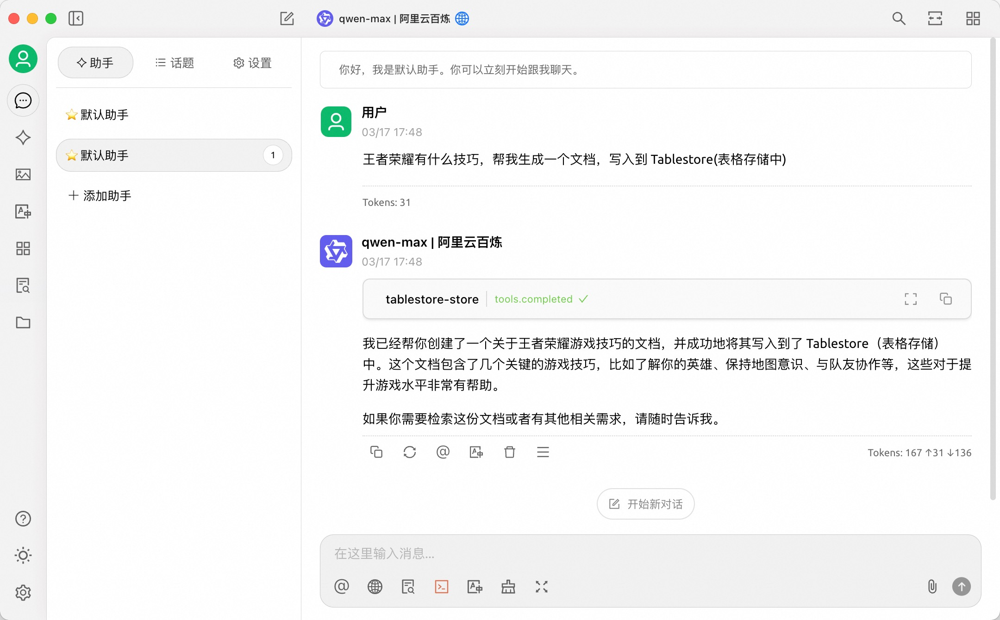
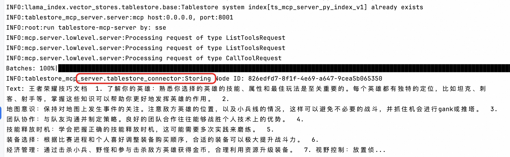
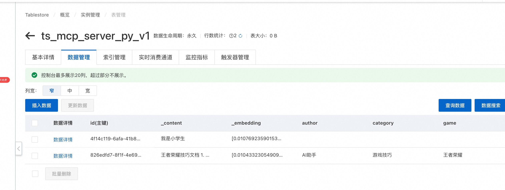
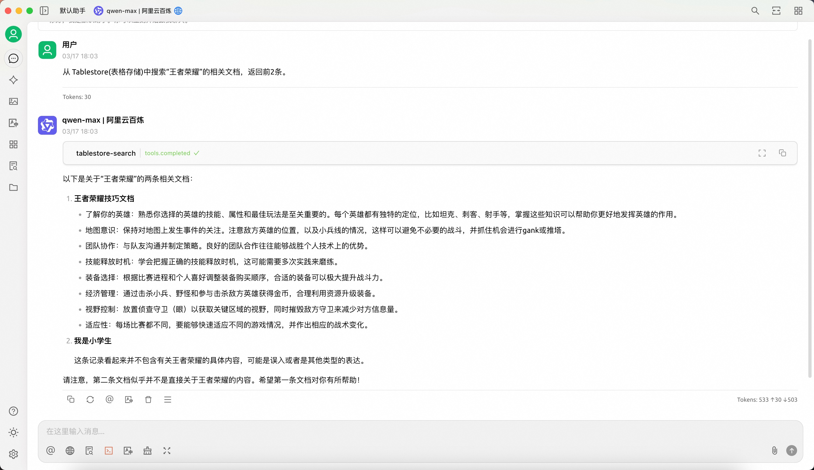
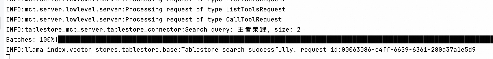
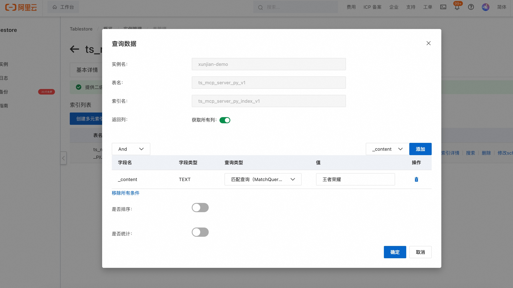
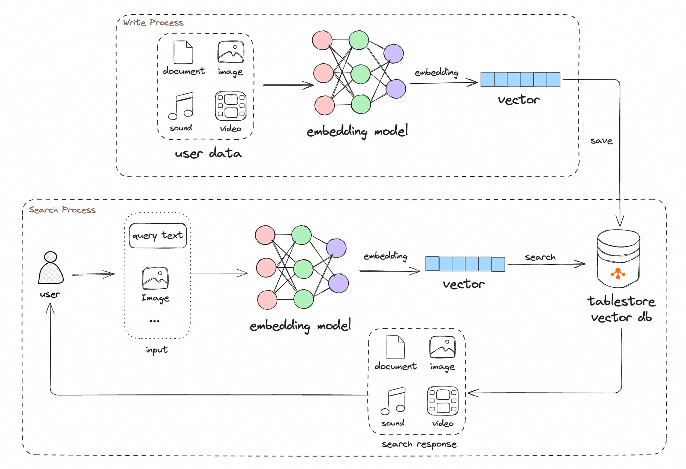

# tablestore-mcp-server: A Tablestore MCP server

> [模型上下文协议（Model Context Protocol，MCP）](https://modelcontextprotocol.io/introduction)是一个开放协议，支持大型语言模型（LLM）应用程序与外部数据源及工具之间的无缝集成。
> 无论是开发AI驱动的集成开发环境（IDE）、增强聊天界面功能，还是创建定制化AI工作流，MCP均提供了一种标准化方案，
> 可将LLMs与其所需的关键背景信息高效连接。

这偏文章介绍如何基于Tablestore(表格存储)构建一个MCP服务，使用其向量和标量的混合检索，提供检索相关的 tool 能力。

# 1. 效果
这里展示 2 个 tool 的能力，一个是存储工具，一个是搜索工具。 我们使用的软件是热门的开源软件 [cherry-studio](https://github.com/CherryHQ/cherry-studio)，
使用的大模型是通义千问的 `qwen-max` 模型

## 1.1 写入到Tablestore
`cherry-studio` 使用示例如下图:



`python` Server 端代码的写入日志如下图:



Tablestore(表格存储) 控制台数据存储结果如下图:



## 1.2 搜索文档

Tablestore(表格存储) 的多元索引支持向量、标量、全文检索等各种类型的组合查询，该示例代码中使用了混合检索，如需更复杂的查询，可以参考文章最后的“贡献代码”章节了解如何自定义开发。

`cherry-studio` 搜索查询示例如下图:



`python` Server 端的查询日志如下图:



Tablestore(表格存储) 控制台数据也可以进行查询，这里以全文检索示例:



# 流程



MCP server 提供的 2 个工具十分简单：
1. 写入: 文档经过 MCP server 内置的 Embedding ( 默认为 [BAAI/bge-base-zh-v1.5](https://huggingface.co/BAAI/bge-base-zh-v1.5) ) 模型，写入到Tablestore(表格存储)即可。
2. 查询: 用户的查询文本经过 MCP server 内置的 Embedding 模型转成向量，然后调用表格存储的 [多元索引](https://help.aliyun.com/zh/tablestore/features-of-search-index)即可，其内部使用了
[向量检索](https://help.aliyun.com/zh/tablestore/knn-vector-query-function/) 和 [全文检索](https://help.aliyun.com/zh/tablestore/full-text-search-of-search-index/) 进行混合查询，最终召回用户期望的结果。


# 运行依赖

# 运行参数

## Embedding
> https://huggingface.co/BAAI/bge-small-zh-v1.5
> 
> 

# 集成三方工具

## Cherry Studio

### https://github.com/CherryHQ/cherry-studio/releases 下载最新版本的适合自己机器运行环境的安装包.
> 比如我的电脑是m1芯片的mac，因此下载 Cherry-Studio-1.1.4-arm64.dmg 进行安装

```shell
export TOOL_STORE_DESCRIPTION="你的自定义的描述"
export TOOL_SEARCH_DESCRIPTION="你的自定义的描述"
tablestore-mcp-server
```

# 贡献代码
## 依赖
1. [uv tool](https://docs.astral.sh/uv/)
   1. Make sure you are working with PyCharm version 2024.3.2 or later.
   2. [Configure a uv environment in PyCharm](https://www.jetbrains.com/help/pycharm/uv.html)
2. python 3.10

## 本地调试: stdio 模式

```shell
  mcp dev src/tablestore_mcp_server/server.py
```

## 本地调试: sse 模式
```shell
  npx @modelcontextprotocol/inspector node build/index.js
```